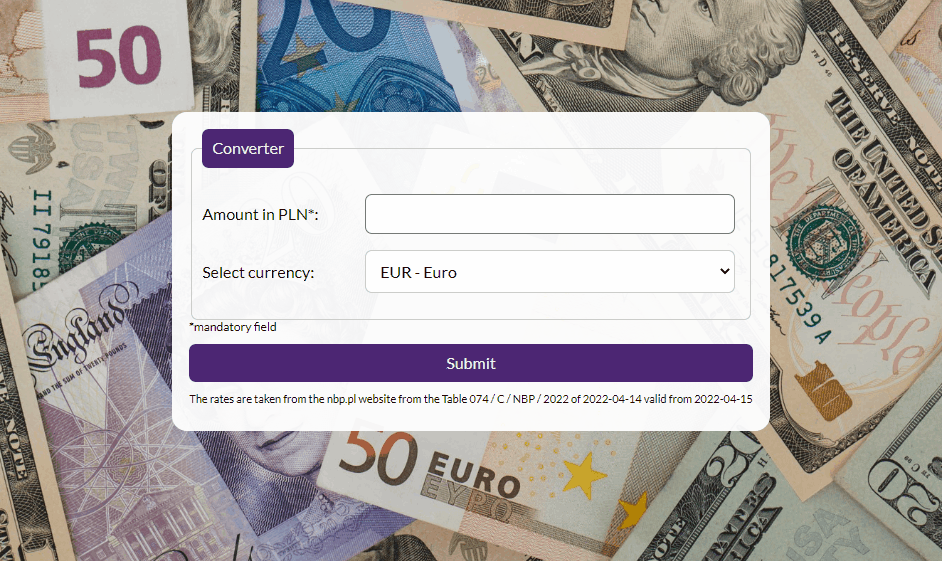

#  Currency Converter App
This webpage was created as a part of [YouCode](https://youcode.pl) course. It's a simple currency converter app which converts PLN to EUR, USD, CHF, GBP and NOK.

##  How to use
1. Enter the amount in the "Amount in PLN*" field.
2. Select a currency.
3. Click "Submit" if you want to convert the amount.
4. If the amount was entered, read the result below.

##  Used Technologies
- HTML
- CSS
- JavaScript
- BEM

##  Demo
https://czarnyzucek.github.io/currency-conventer/